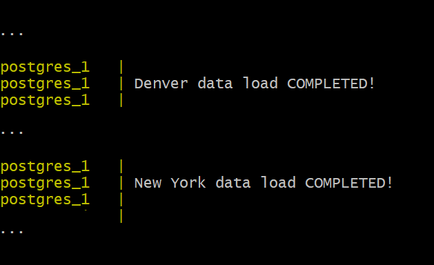

# Event Tracking Map Demo - GeoServer/PostGIS/MapStore 

- [Event tracking map demo](#nyc-event-map-demo-geoserver)
  - [Tested environments](#tested-environments)
  - [New York layers and variables](./NEW-YORK.md#new-york-layers-and-variables)
    - [event](./NEW-YORK.md#event)
    - [region](./NEW-YORK.md#region)
    - [event_region](./NEW-YORK.md#event_region)
    - [hex_cluster_ytd](./NEW-YORK.md#hex_cluster_ytd)
    - [point_cluster_ytd](./NEW-YORK.md#point_cluster_ytd)
    - [square_cluster_ytd](./NEW-YORK.md#square_cluster_ytd)
    - [Providing parameters to SQL views](./NEW-YORK.md##providing-parameters-to-sql-views)
  - [Denver layers and variables](./DENVER.md#denver-layers-and-variables)
    - [crime_location](./DENVER.md#crime_location)
    - [crime_location_full](./DENVER.md#crime_location_full)
    - [precints](./DENVER.md#precints)
    - [crimes_precint](./DENVER.md#crimes_precint)
    - [hex_cluster_ytd](./DENVER.md#hex_cluster_ytd)
    - [point_cluster_ytd](./DENVER.md#point_cluster_ytd)
    - [square_cluster_ytd](./DENVER.md#square_cluster_ytd)
    - [Providing parameters to SQL views](./DENVER.md##providing-parameters-to-sql-views)

This repository contains a GeoServer data directory for the event demo map. In particular, it provides:
- A ``datadir`` with the definition of workspaces, database connections, layers and styles to create the layers for New York and Denver Crime Maps.
- A `sql` folder containing scripts to load New York and Denver crime locations and police precincts.
- A Docker compose file that sets up a GeoServer running on said data directory, and a PostgreSQL/PostGIS database loaded with the data, already setup to talk with each other

Before using the machinery above, a ``.env`` file needs to be created, in this directory. The file will contain a couple of 
setup parameters for the PostgreSQL database, e.g.:

```
POSTGRES_PASSWORD=secretpassword
POSTGRES_DB=events-tracker
```

For the time being, keep the file as above, as the GeoServer data directory is using those exact values. This is suitable for development, we'll make it fully parametric later down the road.

Before starting the project you will need to download the New York event data from NYC Open Data by following [these instruction](./nyc-open-data.md).

Once you have an ``new-york.csv`` file downloaded to the ``sql`` folder in this project, just run ``start.sh`` to build the web clients and start up PostgreSQL and GeoServer.

You will know that your data has been completely loaded wehen your console contains both of the following messages:

  

  ```
  ...
  postgres_1   |
  postgres_1   | Denver data load COMPLETED!
  postgres_1   |
  ...
  postgres_1   |
  postgres_1   | New York data load COMPLETED!
  postgres_1   |
  ...
  ```
GeoServer runs at http://localhost:8888/geoserver
New York - Crime Map runs at http://localhost:8888/new-york
Denver -Crime Map runs at http://localhost:8888/denver

 Killing the process (CTRL-C) will result in the two docker containers to shut down. Use ``clean.sh`` to remove the clients and containers.

## Tested environments

Linux machine: 
- Linux Mint 20.1
- Docker version 20.10.5, build 55c4c88
- docker-compose version 1.25.0

Windows machine
- Microsoft Windows [Version 10.0.19042.928]
- Ubuntu 20.04.2 LTS (WSL 2 distro)
- Docker version 20.10.5, build 55c4c88
- docker-compose version 1.28.5, build c4eb3a1f
