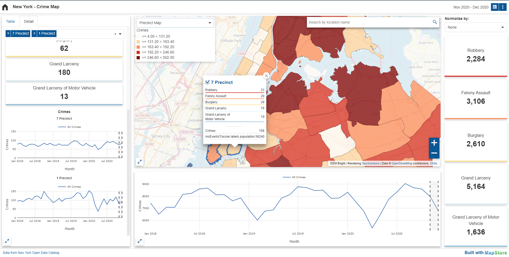
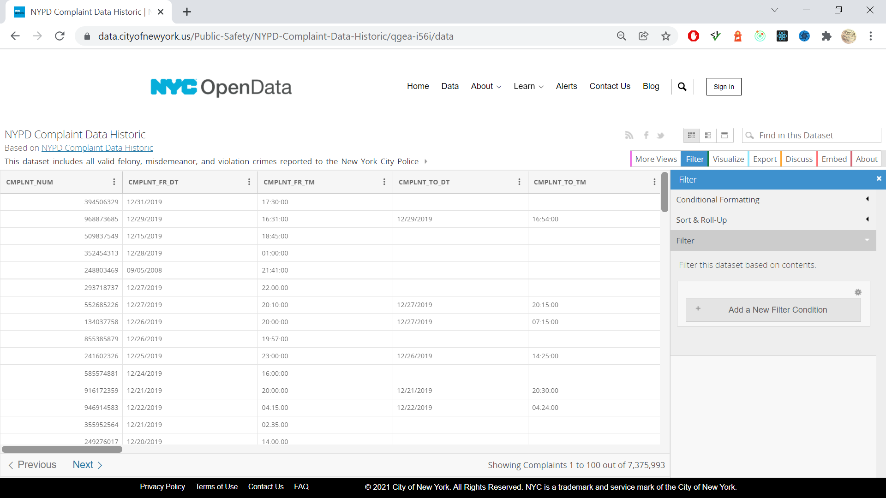
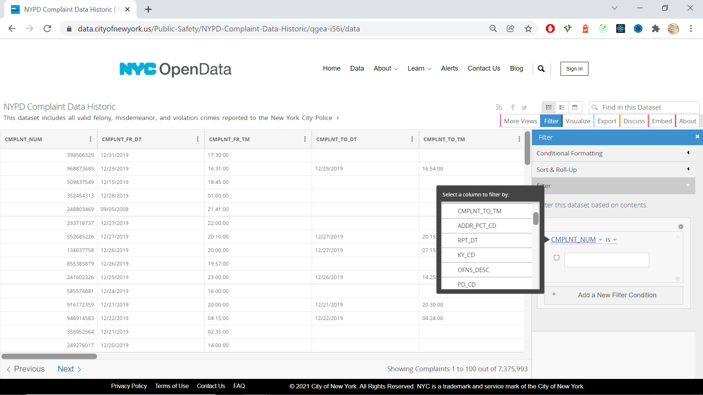
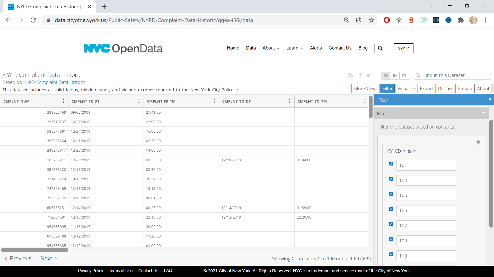
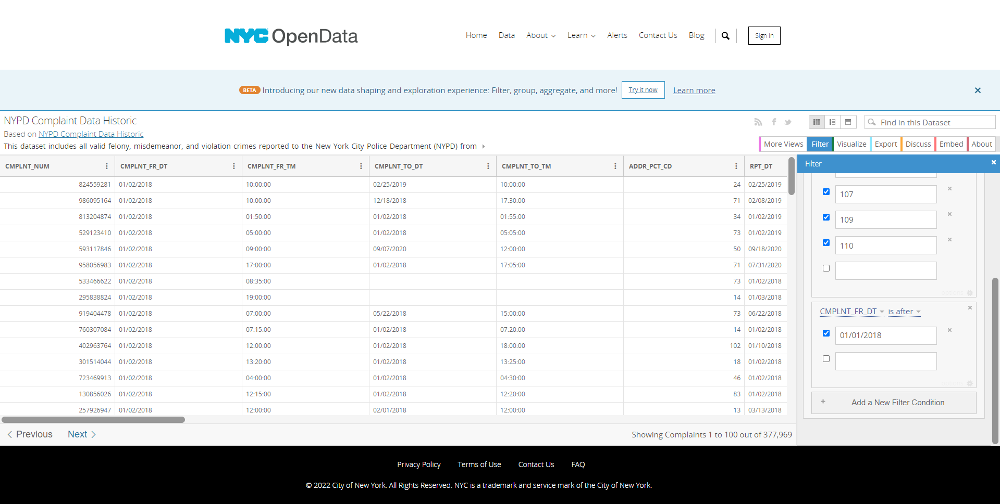
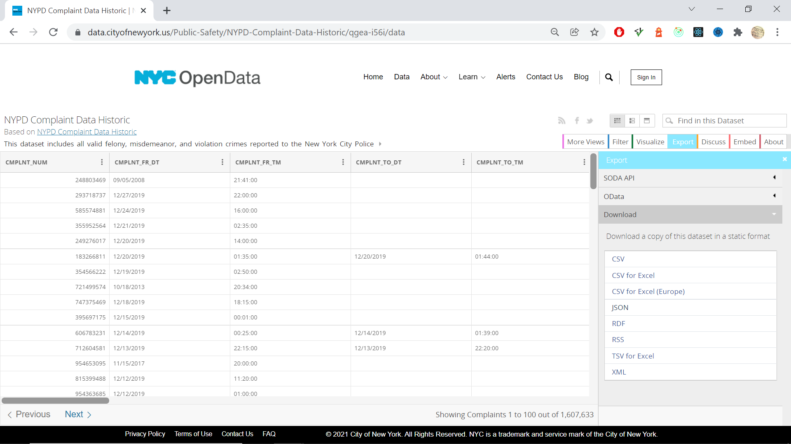

# Events Tracking Map Demo - GeoServer/PostGIS/MapStore 

This project shows how to use GeoServer, PostGIS and MapStore in a docker container to visualize location data related to an event. The sample data provided in the repository is crime/complaint data of the cities of New York and Denver available to the open data portals.



Table of content

- [Development](#development)
- [Download and process data](#download-and-process-data)
- [GeoServer layers](#geoserver-layers)
- [Tested environments](#tested-environments)
## Development

This repository provides:
- A `datadir` folder with the definition of workspaces, database connections, layers and styles to create the layers for the Denver Crime Map, New York Crime Map and New York 311 Service Request Map.
- A `sql` folder containing sample data of New York and Denver crime locations and police precincts as well as 311 SR locations and community districts.
- A docker compose file that sets up a GeoServer running on said data directory, and a PostgreSQL/PostGIS database loaded with the data, already setup to talk with each other
- The `packages/mapstore-events-tracker` folder containing the source files for the frontend application.

### GeoServer setup

Before using the machinery above, a ``.env`` file needs to be created, in this directory. The file will contain a couple of 
setup parameters for the PostgreSQL database, e.g.:

```
POSTGRES_PASSWORD=secretpassword
POSTGRES_DB=events-tracker
```

For the time being, keep the file as above, as the GeoServer data directory is using those exact values. This is suitable for development, we'll make it fully parametric later down the road.

Finally run ``start.sh`` to build the web clients and start up PostgreSQL and GeoServer.

The data import in the database could take some time so ensure that the docker has completed the process via logs.

- GeoServer runs at http://localhost:8888/geoserver
- Denver Crime Map runs at http://localhost:8888/denver
- New York Crime Map runs at http://localhost:8888/new-york
- New York 311 SR Map runs at http://localhost:8888/nyc-311

 `CTRL-C` will Kill the process and shut down the two docker containers. Use ``clean.sh`` to remove the clients, containers and PostgreSQL data.

 ### MapStore Events Tracker app setup (optional)

The mapStore-events-tracker up is a MapStore downstream project with custom plugins that compose the UI interface. Most of the configuration are applied with json file that does not require a new build of the application but in case is needed is possible to run the source file in development mode and be able to modify files and configurations:

- [MapStore Events Tracker documentation](./packages/mapstore-events-tracker/README.md)


## Download and process data

This repository provides some data samples that have been download from the following portals:

demo | url | description |
--- | --- | --- |
New York Crime Map | https://data.cityofnewyork.us/Public-Safety/NYPD-Complaint-Data-Historic/qgea-i56i/data | download the csv file with following type filters KY_CD=105, 106, 107, 109, 110 |
New York 331 SR Map | https://data.cityofnewyork.us/Social-Services/311-Service-Requests-from-2010-to-Present/erm2-nwe9/data | download the csv file with following type filters complaint_type=Noise, Noise - Commercial, Noise - Helicopter, Noise - House of Worship, Noise - Park, Noise - Residential, Noise - Street/Sidewalk, Noise - Vehicle |
Denver Crime Map | https://www.denvergov.org/opendata/dataset/city-and-county-of-denver-crime |  |

This section shows how one of the sample data has been downloaded and processed. This example the NYC Open Data portal focusing on the [NYC Open Data - NYPD Complaint Data Historic](https://data.cityofnewyork.us/Public-Safety\nYPD-Complaint-Data-Historic/qgea-i56i) dataset.

### Download data

Before downloading we must filter the data to the specific complaint types our client application has been configured to support.

[View the NYPD Complaint Data Historic data set](https://data.cityofnewyork.us/Public-Safety/NYPD-Complaint-Data-Historic/qgea-i56i/data) and follow the steps below:

- Click the *Filter* button
- Click the *Add a New Filter Condition* button

    

- Choose the *KY_CD* column (represent the type of crime)

    

- Add the values ``105, 106, 107, 109, 110``

    

- Click again the *Add a New Filter Condition* button

- Choose the *CMPLNT_FR_DT* column with the `is after` operator (represent the date)

- Add the value ``01/01/2018``

    

- Click the *Export* button
- Click *CSV*

    

Finally we downloaded the data from the NYC Open Data from [here](https://data.cityofnewyork.us/Public-Safety/Police-Precincts)

### Process data

The downloaded csv file is not ready yet because it needs some additional adjustment before importing it in the database. We are expecting to create two table in the database: event and region.

Inside the repository we have import scripts for the sample database that can be found [here](../sql/import/new-york.sql.gz). These sql script takes the download csv file and convert it in the expected tables. These scripts contains already the region table for the new york precincts. In case of different area the region table must be replaced with the structure described below.

This snippet of code extracted from `sql/import/new-york.sql.gz` show how the original crime data is processed to fit the event table structure.

```sql
INSERT INTO newyork.event (
  src_id,
  the_geom,
  region_name,
  type,
  month,
  date,
  longitude,
  latitude
)
SELECT
  cmplnt_num,
  ST_SetSRID(POINT(longitude, latitude)::geometry, 4326),
  addr_pct_cd,
  ky_cd,
  TO_CHAR(TO_DATE(cmplnt_fr_dt,'mm/dd/yyyy'), 'yyyymm')::bigint,
  TO_TIMESTAMP(
    TO_CHAR(TO_DATE(cmplnt_fr_dt,'mm/dd/yyyy'), 'yyyy-mm-dd') || ' ' || cmplnt_fr_tm,
    'YYYY-MM-DD HH24:MI:SS'
  ),
  longitude,
  latitude
FROM newyork.tmp_csv
WHERE TO_CHAR(TO_DATE(cmplnt_fr_dt, 'mm/dd/yyyy'), 'yyyy')::bigint > 2005
  AND addr_pct_cd IS NOT NULL
  AND (longitude BETWEEN -74.2556 AND -73.70000)
  AND (latitude BETWEEN 40.4961 AND 40.9156);
```

The current sample data is already prepared with the correct table structure so it does need additional setup step. The sql data is imported via docker-compose.yml in the postgres service:

```yml
...
volumes:
    - ./sql/nyc-311.sql.gz:/docker-entrypoint-initdb.d/nyc-311.sql.gz
    - ./sql/denver.sql.gz:/docker-entrypoint-initdb.d/denver.sql.gz
    - ./sql/new-york.sql.gz:/docker-entrypoint-initdb.d/new-york.sql.gz
...
```

So it is possible to add a new entry to the volumes with the correspondent sql script where each schema must have the event and region table with the following structure.

### `event` table

This table contains all the point locations of the events. It expect following columns:

column | type | description |
--- | --- | --- |
`id` | [PK] bigint | primary key |
`src_id` | text | id from the original data source |
`type` | text | type of event, eg. category |
`region_name` | text | name of the region where the event has been registered |
`month` | bigint | month value formatted as YYYYMM |
`date` | timestamp without timezone | data from the original data source |
`longitude` | double precision | longitude of the event |
`latitude` | double precision | latitude of the event |
`the_geom` | geometry | point geometry of the event |

### `region` table

This table contains all the region represented as polygon geometries where the event has been registered. It expect following columns:

column | type | description |
--- | --- | --- |
`id` | [PK] bigint | primary key |
`name` | text | name of the region, eg. the precinct name |
`group_name` | text | name of an higher level administrative division that include this region, eg. the borough name |
`population` | numeric | population of the region |
`the_geom` | geometry | polygon geometry of the region |

Finally running the ./start.sh command all the schemas will be imported in the docker postgres database. This process will not create automatically the layer on GeoServer that need to be configured manually once time.

## GeoServer layers

The layers used in the dashboards are mainly layer created with sql view that uses as base data sources the `event` and `region` tables.
The layers used by the default client application are:

name | layer type | description |
--- | --- | --- |
`event_full` | sql view | used for WPS request to display data in charts, counter and table
`region` | PostGIS datastore | used for WFS to requests to store information about the precincts
`event_region_gt` | sql view | used for WFS requests to visualize the precincts on map
`hex_cluster_ytd_gt` | sql view | used for WFS requests to visualize the hexagon on map
`square_cluster_ytd_gt` | sql view | used for WFS requests to visualize the square on map
`point_cluster_ytd_gt` | sql view | used for WFS requests to visualize the point cluster on map

Here some additional documentation about the created layers:

- [GeoServer SQL view layers statements](docs/sql-views.md)
- [New York layers and variables](docs/new-york-crime-layers.md)
- [New York layers and variables](docs/new-york-311-layers.md)
- [Denver layers and variables](docs/denver-crime-layers.md)

Note: layer for the denver workspace uses a different name convention for the event and region tables
## Tested environments

Linux machine: 
- Linux Mint 20.1
- Docker version 20.10.5, build 55c4c88
- docker-compose version 1.25.0

Windows machine
- Microsoft Windows [Version 10.0.19042.1348]
- Ubuntu 20.04.2 LTS (WSL 2 distro)
- Docker version 20.10.10, build b485636
- docker-compose version 1.29.2, build 5becea4c

> :warning: **Known Docker issues in Apple M1 computers**: The project might have difficulties running in computers running Apple M1 chips. 
> [Here](https://docs.docker.com/desktop/mac/apple-silicon/) are documented some known issues with Docker in Apple M1 computers 
