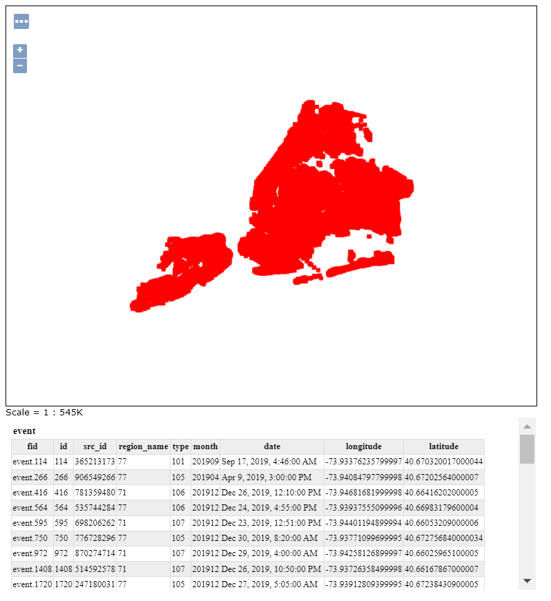
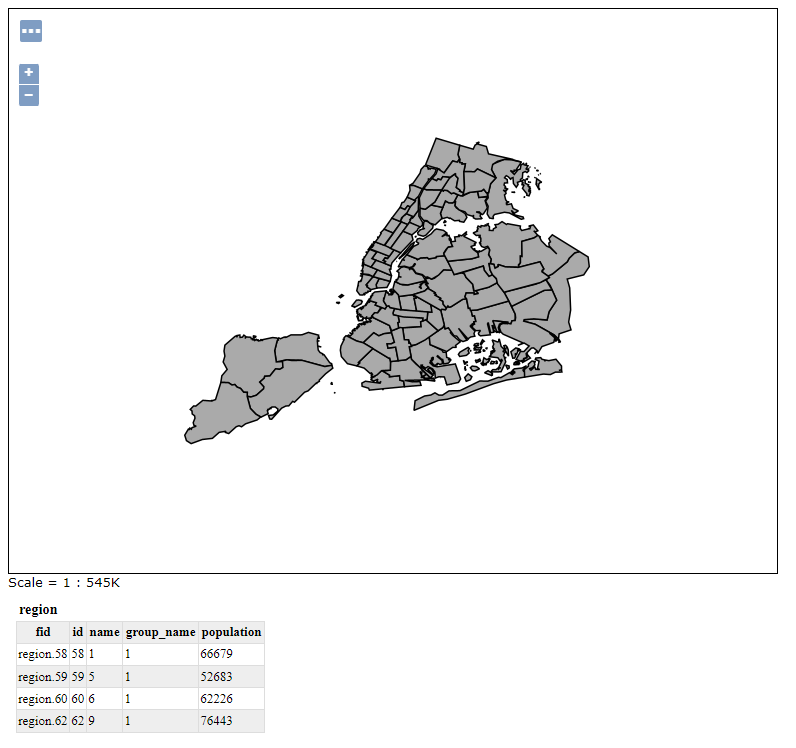
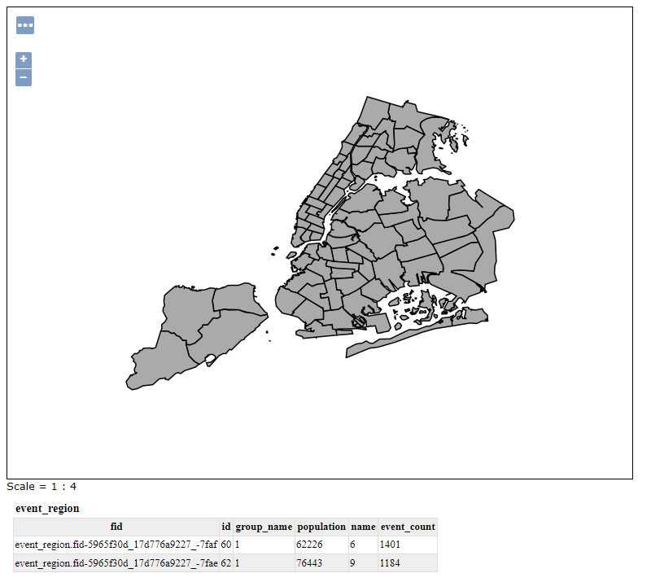
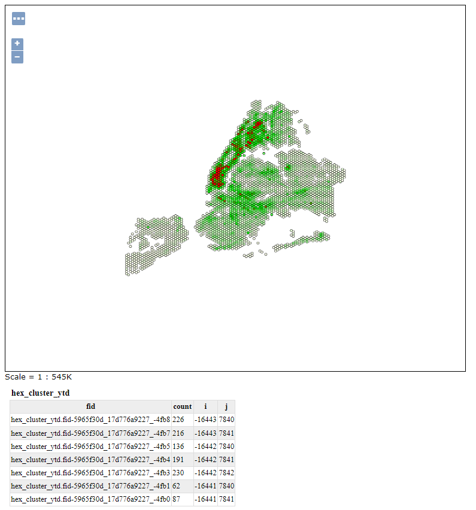
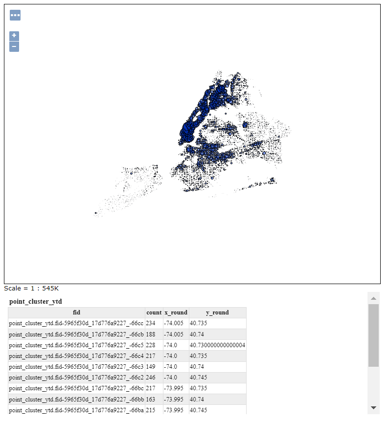
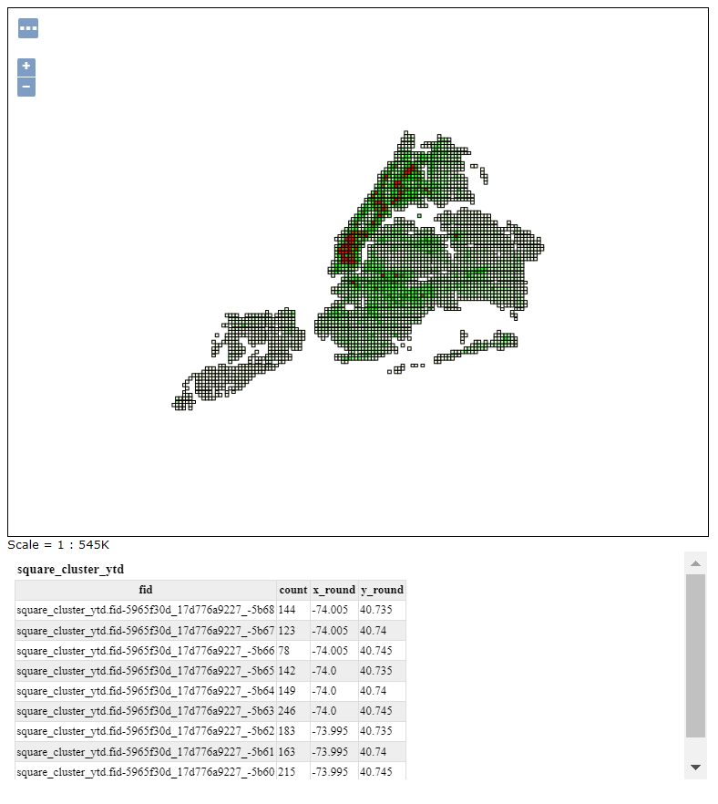

# Event Tracking Map Demo - GeoServer/PostGIS/MapStore 

- [Event tracking map demo](#nyc-event-map-demo-geoserver)
  - [Tested environments](#tested-environments)
  - [Layers and variables](#layers-and-variables)
    - [event](#event)
    - [region](#region)
    - [event_region](#event_region)
    - [hex_cluster_ytd](#hex_cluster_ytd)
    - [point_cluster_ytd](#point_cluster_ytd)
    - [square_cluster_ytd](#square_cluster_ytd)
  - [Providing parameters to SQL views](#providing-parameters-to-sql-views)

This repository contains a GeoServer data directory for the event demo map. In particular, it provides:
- A data directory, in ``datadir``, with the definition of database connections, layers and style to re-create the event and region map layers
- A script ``events-tracker.sql.gz`` to load region data and event data from an ``event.csv`` file downloaded from NYC Open Data
- A Docker compose file that sets up a GeoServer running on said data directory, and a PostgreSQL/PostGIS database loaded with the data, already setup to talk with each other

Before using the machinery above, a ``.env`` file needs to be created, in this directory. The file will contain a couple of 
setup parameters for the PostgreSQL database, e.g.:

```
POSTGRES_PASSWORD=secretpassword
POSTGRES_DB=events-tracker
```

For the time being, keep the file as above, as the GeoServer data directory is using those exact values. This is suitable for development, we'll make it fully parametric later down the road.

Before starting the project you will need to download the event data from NYC Open Data by following [these instruction](./nyc-open-data.md).

Once you have an ``event.csv`` file downloaded to the project root, just run ``start.sh`` to start up PostgreSQL and GeoServer. Killing the process (CTRL-C) will result in the two docker containers to shut down.
If you want to also remove the containers, then use ``clean.sh``.

GeoServer runs at http://localhost:8888/geoserver

## Tested environments

Linux machine: 
- Linux Mint 20.1
- Docker version 20.10.5, build 55c4c88
- docker-compose version 1.25.0

Windows machine
- Microsoft Windows [Version 10.0.19042.928]
- Ubuntu 20.04.2 LTS (WSL 2 distro)
- Docker version 20.10.5, build 55c4c88
- docker-compose version 1.28.5, build c4eb3a1f

## Layers and variables

### event

Reports locations of each event, with a type and a date expressed as a number in ``YYYYMM`` format.
This layer ddirectly publishes the event table from the database.

#### event.type
  - 101 Murder and Non-Negligent Homicide
  - 105 Robbery
  - 106 Felony Assalt
  - 107 Burglary
  - 109 Grand Larceny
  - 110 Grand Larceny of Motor Vehicle



### event_full

Same as event, but provides information about the region and the group name.

### region

The region, with name and population.




### event_region

Reports the region, the event count, and the event count per 1000 inhabitants.



This layer is a SQL view based on the ``event_region`` function. It accepts the following variables:

* ``max_mo``: maximum month for time filters, expressed as ``YYYYmm``. Defaults to 202102.
* ``min_mo``: minimum month for time filters, expressed as ``YYYYmm``
* ``event_type``: comma separated list of event types, expressed as SQL strings. Defaults to ``'101','104','105','106','107','109','110'``.

### hex_cluster_ytd

Reports a count of event in hexagonal areas.



This layer is a SQL view and accepts the following variables:

* ``r``: the hexagon radius, defaults to ``0.003`` (in decimal degrees)
* ``max_mo``: maximum month for time filters, expressed as ``YYYYmm``. Defaults to 202102.
* ``min_mo``: minimum month for time filters, expressed as ``YYYYmm``
* ``event_type``: comma separated list of event types, expressed as SQL strings. Defaults to ``'101','104','105','106','107','109','110'``.

### point_cluster_ytd

Clusters points over a regular grid, and reports for each grid cell the count of event, with a point whose position is the centroid of the event accumulated in the cell.



This layer is a SQL view and accepts the following variables:

* ``r``: the cell width, defaults to ``0.005`` (in decimal degrees)
* ``max_mo``: maximum month for time filters, expressed as ``YYYYmm``. Defaults to 202102.
* ``min_mo``: minimum month for time filters, expressed as ``YYYYmm``
* ``event_type``: comma separated list of event types, expressed as SQL strings. Defaults to ``'101','104','105','106','107','109','110'``.

### square_cluster_ytd

Clusters points over a regular grid, and reports for each grid cell the count of event.



This layer is a SQL view and accepts the following variables:

* ``r``: the cell width, defaults to ``0.005`` (in decimal degrees)
* ``max_mo``: maximum month for time filters, expressed as ``YYYYmm``. Defaults to 202102.
* ``min_mo``: minimum month for time filters, expressed as ``YYYYmm``
* ``event_type``: comma separated list of event types, expressed as SQL strings. Defaults to ``'101','104','105','106','107','109','110'``.

### "_gt" views

The layers ending with "_gt" are copies of the aggregating layers listed above, but provide for each aggregation unit
a detail of event aggregated by type, rather than full count. The base layer and the one gruped by type typically share
some attributes to relate them with each other. For the ``event_region_gt`` the ``region.name`` attribute is the obvious choice.
For others, which are grid based, a rounded coordinate or a grid row/col indication is provided instead.

## Providing parameters to SQL views

The SQL View parameters can be provided, in WMS and WFS requests, as part of the URL, using the ``viewparams`` parameter. The various parameters are separated by semicolon, while the comma is used to separate the groups of parameters belonging to different layers (should there be multiple SQL View based layers in the same request). 

This poses a challenge if one of the parameter values requires to use a comma. For this case, the comma can be escaped with a backslash, which also needs to be percent encoded in the URL.

Here is an example viewparam:

``viewparams=mo_min:202012;mo_max:202101;event_type:%27101%27%5C,%27105%27``

It sets the following values:
* ``mo_min``: ``202012``
* ``mo_max``: ``202101``
* ``event_type``: ``'101', '105'``

