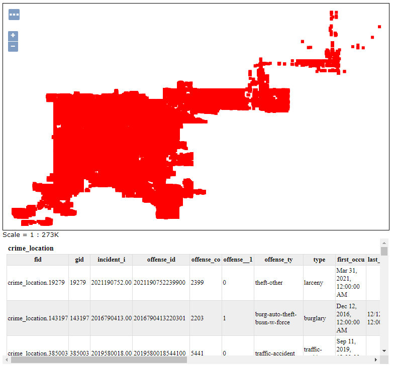
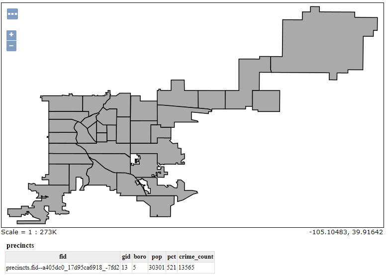
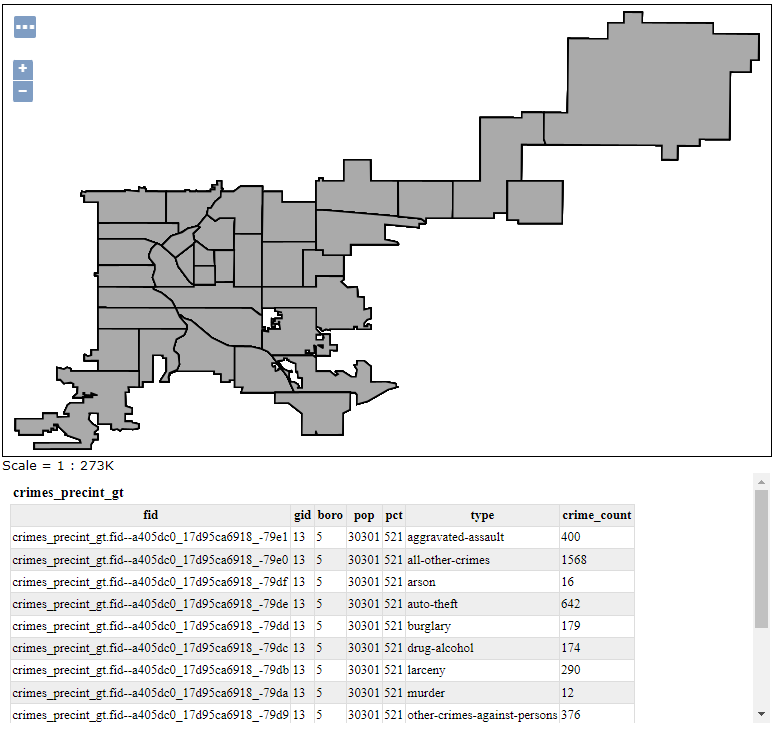
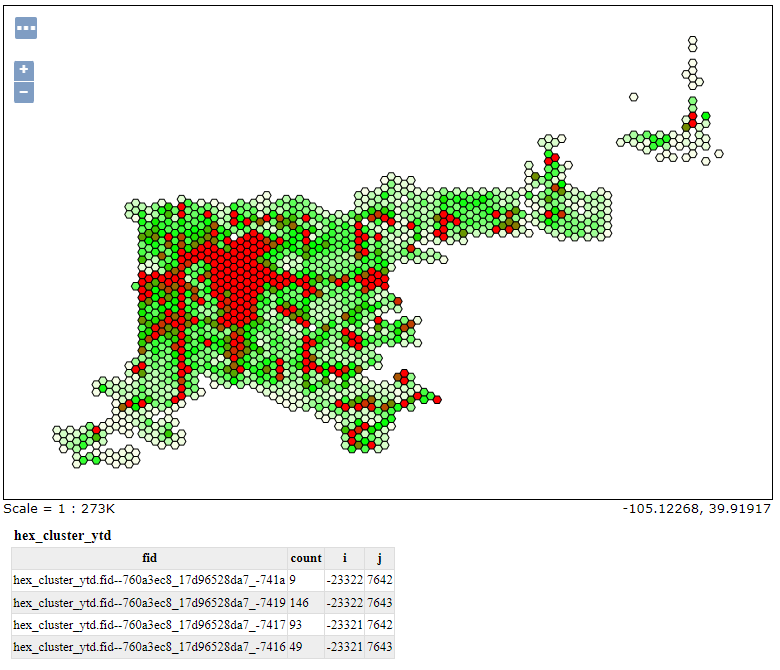
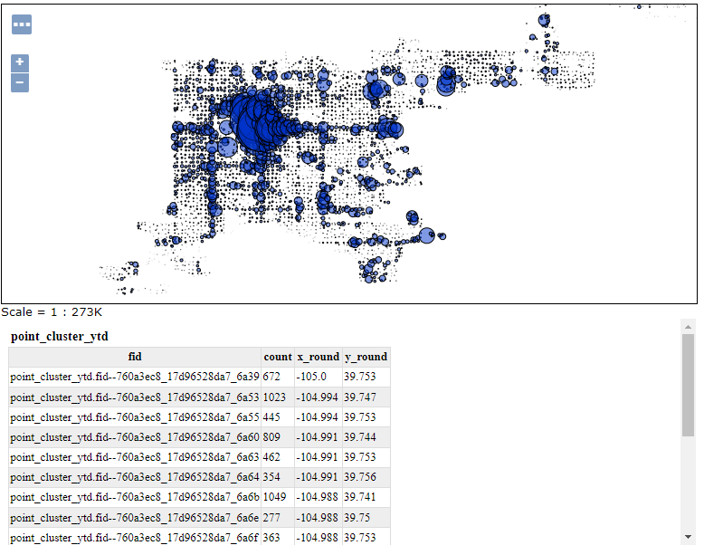
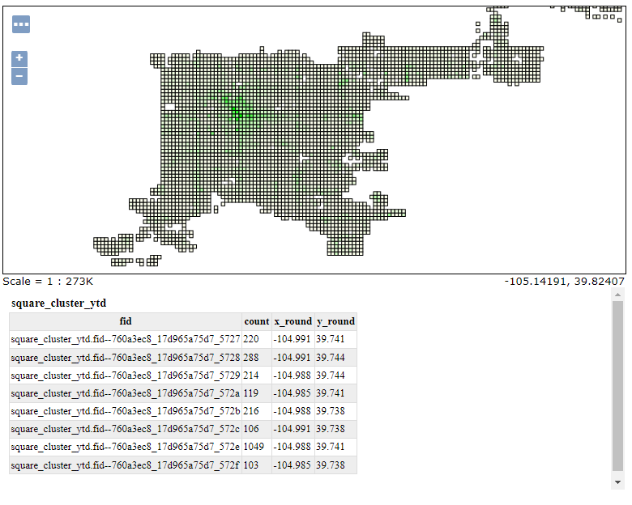

## Denver layers and variables

### crime_location

Reports locations of each crime, with a type and a date expressed as a number in ``YYYYMM`` format.
This layer publishes directly a table in the database.



### crime_location_full

Same as crime_location, but provides information about the precint and the borough name.

### precints

The Denver police precints, with name and population.



### crimes_precint

Reports the precints, the crime count, and the crime count per 1000 inhabitants.



This layer is a SQL view based on the ``crime_precints`` function. It accepts the following variables:

* ``max_mo``: maximum month for time filters, expressed as ``YYYYmm``. Defaults to 202102.
* ``min_mo``: minimum month for time filters, expressed as ``YYYYmm``
* ``crime_type``: comma separated list of crime types, expressed as SQL strings. Defaults to ``'auto-theft', 'FELONY ASSAULT', 'GRAND LARCENY', 'GRAND LARCENY OF MOTOR VEHICLE', 'MURDER', 'RAPE', 'ROBBERY'``.

### hex_cluster_ytd

Reports a count of crimes in hexagonal areas overlayed with New York City.



This layer is a SQL view and accepts the following variables:

* ``r``: the hexagon radius, defaults to ``0.003`` (in decimal degrees)
* ``max_mo``: maximum month for time filters, expressed as ``YYYYmm``. Defaults to 202102.
* ``min_mo``: minimum month for time filters, expressed as ``YYYYmm``
* ``crime_type``: comma separated list of crime types, expressed as SQL strings. Defaults to ``'auto-theft', 'FELONY ASSAULT', 'GRAND LARCENY', 'GRAND LARCENY OF MOTOR VEHICLE', 'MURDER', 'RAPE', 'ROBBERY'``.

### point_cluster_ytd

Clusters points over a regular grid, and reports for each grid cell the count of crimes, with a point whose position is the centroid of the crime locations accumulated in the cell.



This layer is a SQL view and accepts the following variables:

* ``r``: the cell width, defaults to ``0.005`` (in decimal degrees)
* ``max_mo``: maximum month for time filters, expressed as ``YYYYmm``. Defaults to 202102.
* ``min_mo``: minimum month for time filters, expressed as ``YYYYmm``
* ``crime_type``: comma separated list of crime types, expressed as SQL strings. Defaults to ``'auto-theft', 'FELONY ASSAULT', 'GRAND LARCENY', 'GRAND LARCENY OF MOTOR VEHICLE', 'MURDER', 'RAPE', 'ROBBERY'``.

### square_cluster_ytd

Clusters points over a regular grid, and reports for each grid cell the count of crimes.



This layer is a SQL view and accepts the following variables:

* ``r``: the cell width, defaults to ``0.005`` (in decimal degrees)
* ``max_mo``: maximum month for time filters, expressed as ``YYYYmm``. Defaults to 202102.
* ``min_mo``: minimum month for time filters, expressed as ``YYYYmm``
* ``crime_type``: comma separated list of crime types, expressed as SQL strings. Defaults to 
```
'auto-theft', 'other-crimes-against-persons', 'aggravated-assault', 'burglary', 'theft-from-motor-vehicle', 'larceny', 'all-other-crimes', 'murder', 'arson', 'robbery', 'drug-alcohol', 'traffic-accident', 'public-disorder', 'white-collar-crime'
```

### "_gt" views

The layers ending with "_gt" are copies of the aggregating layers listed above, but provide for each aggregation unit
a detail of crimes aggregated by type, rather than full count. The base layer and the one gruped by type typically share
some attributes to relate them with each other. For the ``crime_precints_gt`` the ``pct`` attribute is the obvious choice.
For others, which are grid based, a rounded coordinate or a grid row/col indication is provided instead.

## Providing parameters to SQL views

The SQL View parameters can be provided, in WMS and WFS requests, as part of the URL, using the ``viewparams`` parameter. The various parameters are separated by semicolon, while the comma is used to separate the groups of parameters belonging to different layers (should there be multiple SQL View based layers in the same request). 

This poses a challenge if one of the parameter values requires to use a comma. For this case, the comma can be escaped with a backslash, which also needs to be percent encoded in the URL.

Here is an example viewparam:

``viewparams=mo_min:202012;mo_max:202101;crime_type:%27auto-theft%27%5C,%27robbery%27``

It sets the following values:
* ``mo_min``: ``202012``
* ``mo_max``: ``202101``
* ``crime_type``: ``'auto-theft', 'robbery'``
