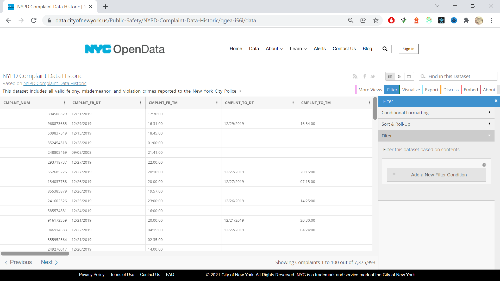
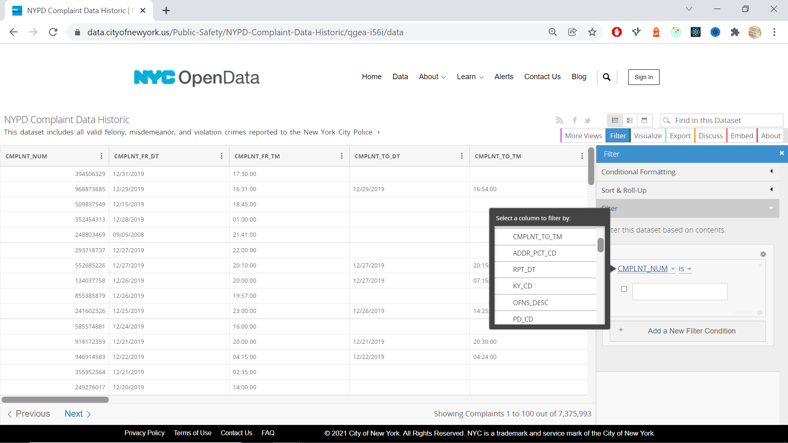
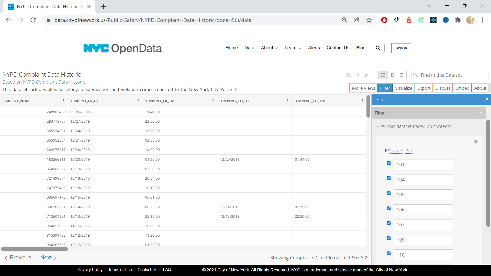
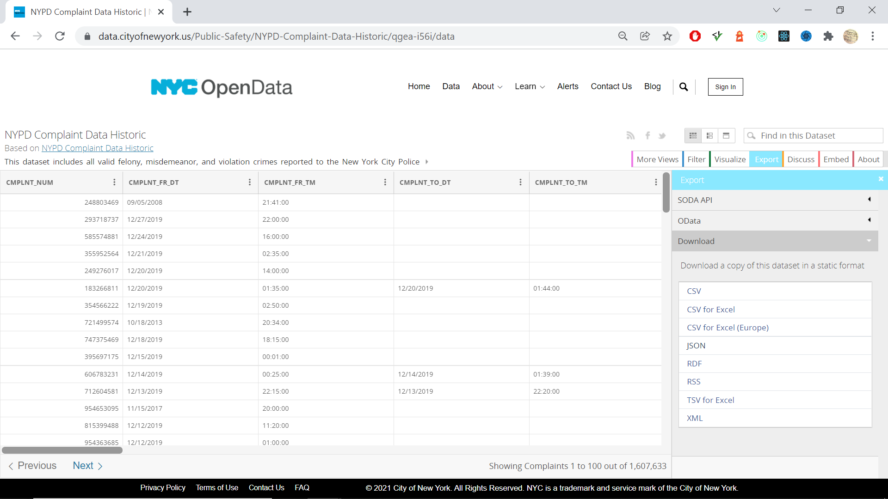

### Download NYPD Complaint Data Historic from NYC Open Data

To review this data set visit 
[NYC Open Data - NYPD Complaint Data Historic](https://data.cityofnewyork.us/Public-Safety\nYPD-Complaint-Data-Historic/qgea-i56i)

Before downloading we must filter the data to the specific complaint types our client application has been configured to support.

[View the NYPD Complaint Data Historic data set](https://data.cityofnewyork.us/Public-Safety/NYPD-Complaint-Data-Historic/qgea-i56i/data) and follow the steps below:

- Click the *Filter* button
- Click the *Add a New Filter Condition* button

    

- Choose the *KY_CD* column

    

- Add the values ``101, 104, 105, 106, 107, 109, 110``

    

- Click the *Export* button
- Click *CSV*

    

- Copy the downloaded file to ``./sql/new-york.csv``

